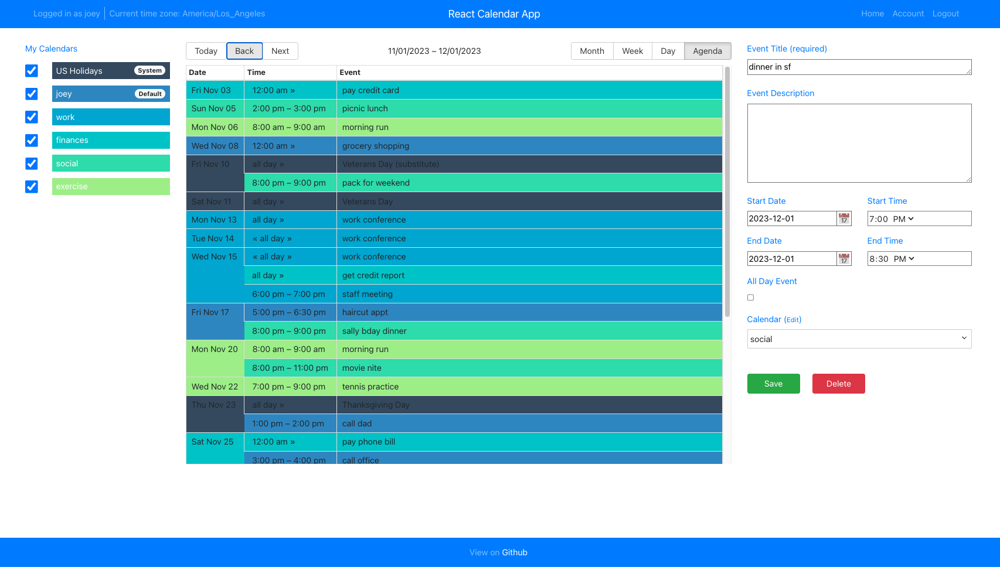

# React Calendar

# Company Communication Management System

## Overview
This project is a comprehensive communication management system designed to facilitate communication and engagement with companies. The system provides a robust Admin module for configuration and data management, while also empowering end-users with an easy-to-use interface to track communications, manage tasks, and generate reports.

### Core Modules:
- **Admin Module**: Configuration and management of companies and communication methods.
- **User Module**: Communication task management, dashboards, and interaction with notifications.
- **Reporting and Analytics Module** (Optional): Provides actionable insights and data visualization.

## Features

### Admin Module

#### 1. **Company Management**
- Admins can add, edit, and delete companies in the system.
- Company details include:
  - **Name**: Company name.
  - **Location**: Physical or operational location.
  - **LinkedIn Profile**: A link to the company's LinkedIn page.
  - **Emails**: One or more email addresses for communication.
  - **Phone Numbers**: Contact numbers for company representatives.
  - **Comments**: Additional notes about the company.
  - **Communication Periodicity**: Default time interval for scheduled communications (e.g., every 2 weeks).

#### 2. **Communication Method Management**
- Admins define communication methods, which include:
  - **Name**: E.g., "LinkedIn Post", "Email", etc.
  - **Description**: A brief explanation of the communication type.
  - **Sequence**: Defines the order of communication (e.g., LinkedIn Post → Email → Phone Call).
  - **Mandatory Flag**: Whether the communication method is required in the sequence.
- Default communication methods include:
  - LinkedIn Post
  - LinkedIn Message
  - Email
  - Phone Call
  - Other

### User Module

#### 1. **Dashboard**
- Displays a grid view of companies and communication statuses.
- Key columns:
  - **Company Name**
  - **Last Five Communications**: Summary of recent communications (type and date).
  - **Next Scheduled Communication**: Upcoming communication type and date.
  - **Color-Coded Highlights**:
    - **Red**: Overdue communication.
    - **Yellow**: Communication due today.
  - Option to disable or override highlights for specific companies.

#### 2. **Interactive Features**
- **Hover Effect**: Tooltip displays notes/comments for completed communications.
- **Communication Action**:
  - Users can select one or more companies.
  - Option to log a new communication:
    - **Type of Communication**: Select from options like LinkedIn Post, Email, etc.
    - **Date of Communication**: Enter the date of communication.
    - **Notes**: Add additional comments.
  - Action resets any existing red or yellow highlights.

#### 3. **Notifications**
- Displays overdue and upcoming communications:
  - **Overdue Communications Grid**: Lists companies with overdue communications.
  - **Today’s Communications Grid**: Lists companies with communications due today.
  - A notification icon displays a badge with overdue and due counts.

#### 4. **Calendar View**
- Visual interface to manage communications:
  - View past communications with details about dates and communication methods.
  - View and manage upcoming communications.

### Reporting and Analytics Module (Optional)

#### 1. **Communication Frequency Report**
- Visual report showing the frequency of each communication method used over a selected period.
- Users can filter by company, communication method, or date range.

#### 2. **Engagement Effectiveness Dashboard**
- Displays metrics on the effectiveness of each communication method.
- Includes percentage of successful responses to emails, phone calls, and LinkedIn messages.

#### 3. **Overdue Communication Trends**
- Displays trends in overdue communications, categorized by company, over time.

#### 4. **Downloadable Reports**
- Allows users to export data in **PDF** or **CSV** formats for offline sharing or analysis.

#### 5. **Real-Time Activity Log**
- Live feed of all communication activities performed.
- Activities can be filtered by date, user, or company.

